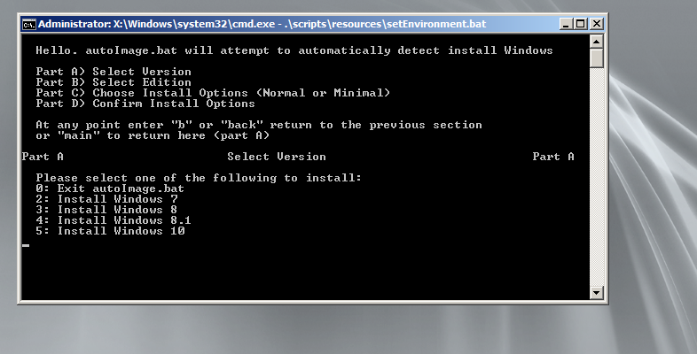
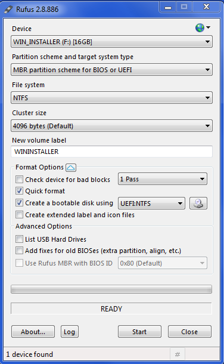

# ADKTools

ADKTools provides a set of Windows scripts to help manage the Windows Automated Deployment Kits (ADKs), Windows Imaging Format (WIM) images and Windows Preinstallation Environments (WinPE).

The project's specific goals are to:

1. Dramatically simplify installing any recent version of Windows (7+) on any hardware (BIOS/UEFI).
2. Stage [AriaDeploy](//github.com/gdiaz384/AriaDeploy).
3. Simply the management of WIM images and typical deployment tasks.

The development emphasis is on zero-configuration "just works" software.

## Screenshots:




## Features:

- Automatically install AIK 7, ADK 81 U and ADK 10
- Automatically generate WinPE.wim and WinPE.iso images (3.1,5.1,10)
- Supports WinPE.wim -> WinPE.iso conversion
- Supports WIM <-> ESD conversion
- Create WinPE images that support booting via: CD/USB/HD or PXE
- Image systems from local media WIMs or over the network transparently
- Automatically update the following WinPE aspects:
    - Drivers (Dell, HP, Lenovo*)
    - Packages (add WMI support)
    - Tools (DISM/BCDboot)
    - Scripts
- The included PE scripts transparently:
    - Map network drives (requires a configured FTP server)
    - Stage AriaDeploy
    - Stage AutoImage (Automatically detect and install WIM/ESD images)
    - Provide a CLI frontend for DISM to help capture/deploy WIM images manually
        - Note: GImageX is also included as a gooey front-end.
- Creates a WinPE workspace to easily make changes to WIM images.

*Lenovo drivers can be installed automatically but must be downloaded/extracted manually.

## Use Cases:

1. The "How do I Clean Install?" problem solved. Forever.
3. Use predefined images on computers that need fixing OEM style.
    - Recovery tools (can) include DaRT+WindowsRE and a boot menu at startup.
4. Run arbitrary windows software in a temporary (WinPE) environment. 
    - Use alternative imaging software such as: Ghost, Acronis (maybe) and murphy78's diskpart script.
5. Create a WIM backup of the current OS (image.bat or GImageX) for either restoration or deployment.
    - Can be used with "hard disk swap" or "hardware transfer" scenarios.   
6. Quickly regenerate WinPE images when minor changes need to be made.
7. Configure WinPE.wim multiboot scenarios on either a portable USB drive or on target systems 
    - This allows booting WinRE or DaRT for recovery purposes OEM style.
8. Saves time when installing arbitrary Windows versions 
    - Upgrade to Win 7 or downgrade to Win 10 at leisure.
    - Compare arbitrary Windows versions (such as Windows 10 Enterprise LTSB vs RTM Home).
    - Especially useful when compiling version/architecture specific software (Hint: Use VMs.)
9. Compress WIM images into Electronic Software Delivery (ESD) formated files and deploy Microsoft's ESD images directly.
10. Stage AriaDeploy.

## Download:

    Latest Version: 0.1.0-beta
    In Development: 0.1.1-beta

Click [here](//github.com/gdiaz384/ADKTools/releases) or on "releases" at the top to download the latest version.

## Typical Usage Guide:

1. Obtain a 32GB (minimum) or 64GB (recommended) flash drive [Ebay Search](//www.ebay.com/sch/i.html?_odkw=usb+64+3.0&Brand=ADATA|Kingston|Patriot%2520Memory|Samsung&_sop=15&LH_ItemCondition=3&_dcat=51071&_osacat=51071&_from=R40&_trksid=p2045573.m570.l1313.TR0.TRC0.H0.Xusb+64+3.0+newegg.TRS0&_nkw=usb+64+3.0+newegg&_sacat=51071)
2. In a VM, download ADKTools from [here](//github.com/gdiaz384/ADKTools/releases) and extract.
3. Check to make sure the VM will not sleep when idle (control panel->power options->change plan settings)
4. Start an administrative cmd prompt (or disable UAC) and navigate to ADKTools\
5. Run installADK.bat to install at least one of the ADKs (AIK != ADK). All 3 (AIK + ADKs x2) are preferred.
6. Wait to install AIK manually (next->next->next)
7. Run createWinPE.bat to generate updated WinPE.wim and WinPE.iso files (This will take a while.)
    - Note: Windows Deployment Services can PXE boot WinPE.wim files (WDS 2012+ supports both BIOS/UEFI)
    -  If not using WDS or USB: It is possible to burn these ISO files to optical media.
    - Use a Deployment Prompt and run "convertwim toiso" or "massupdate export" to regenerate ISO files.
9. Obtain installer.wim files (or ISOs) for the versions/architectures/editions of windows to install. MS links:
    - [Windows 7](//www.microsoft.com/en-us/software-download/windows7), [Windows 8.1](//www.microsoft.com/en-us/software-download/windows8), [Windows 10](//www.microsoft.com/en-us/software-download/windows10)
    - Note: With ISOs, look for sources\install.wim, (not boot.wim). Extract out and rename them appropriately.
    - "dism /get-wiminfo /wimfile:c:\install.wim" to check the included editions
10. Copy any WIM images (install.wim\win7x64.wim) to ADKTools\WININSTALLER\sources 
11. Download [Rufus](//rufus.akeo.ie) and insert USB drive from step #1
12. Launch Rufus, Alt+E (important), and then make a USB drive bootable with the following settings:

13. After formating completes, copy WININSTALLER\ contents to flash drive.
14. Safely eject the USB drive.
15. Boot the target system from USB drive. Consult the manufacturer's documentation for this.
16. Follow the onscreen menus provided by autoImage.bat

## Advanced Usage Notes:

### To automatically map drives to image over the network:

1. Install and configure an FTP server such as [FileZilla](//sourceforge.net/projects/filezilla/files/FileZilla%20Server/0.9.57/FileZilla_Server-0_9_57.exe/download)
2. create a text file named "credentialsForNetworkDrive.txt" with the following contents:
    ```
    clientDriveLetter=Y
    sharePath=myshare$
    serverAddress=2008R2mdt
    username=limitedUser
    password=mypassword

    ::(optional) this path is relative to the share path
    deployClientPathAndExe=AriaDeploy\client\AriaDeployClient.bat
    ```
3. place "credentialsForNetworkDrive.txt" in the FTP home directory
4. modify "winPEWorkspace\Updates\peRuntime\scripts\mapNetworkDrive.bat" to include the serveraddress (IP or NetBIOS name), and the FTP credentials (user name/password)
5. Update the WinPE runtime scripts
6. share a folder with an images\ directory as myshare$ 
Example Path: C:\Users\User\Desktop\winPEWorkspace\Images\Win7\Win7Sp1_x64_RTM.wim
    ```
    net share myshare$=C:\Users\User\Desktop\winPEWorkspace /grant:limitedAccount,read
    ```
7. Allow ICMP echo requests through the local firewall
8. Disable FTP server when not in use to limit exposure.

### To update the WinPE runtime scripts:

1. Make any changes winPEWorkspace\Updates\peRuntime\scripts
2. open a Deployment Tools Environment
```
massupdate scripts 5 x64
massupdate export 5 x64
or
massupdate scripts all
massupdate export all
```

### To reset the WinPE images (add/remove drivers or packages):

- Open a Deployment Tools Environment
```
massupdate reset 3 x86
massupdate export 3 x86
or
massupdate reset all
massupdate export all
```
Note: Drivers from winPEWorkspace\Updates\drivers\3_x\x86 will be installed automatically. To not install drivers, delete them from this folder.

### For a system boot menu with DaRT/WinRE/WinPE (normal install):

Place the following files in "WININSTALLER\sources\Win7\winPETools":
```
DaRT7_x86.wim, DaRT7_x64.wim
WinRE31_x86.wim, WinRE31_x64.wim
WinPE31_x86.wim, WinPE31_x64.wim
```

Place the following files in "WININSTALLER\sources\Win81\winPETools":
```
DaRT81_x86.wim, DaRT81_x64.wim
WinRE51_x86.wim, WinRE51_x64.wim
WinPE51_x86.wim, WinPE51_x64.wim
```

Place the following files in "WININSTALLER\sources\Win10\winPETools":
```
DaRT10_x86.wim, DaRT10_x64.wim
WinRE10_x86.wim, WinRE10_x64.wim
WinPE10_x86.wim, WinPE10_x64.wim
```

- To reduce the user prompt duration: "bcdedit /timeout 3"
- On Win 8-10, the legacy boot menu is also recommended: "bcdedit /set {default} bootmenupolicy legacy"
- For more information on Microsoft's Diagnostics and Recovery Toolset: ([DaRT](//technet.microsoft.com/en-us/windows/hh826071))
- For additional information on Windows Recovery Environment: ([WinRE](//technet.microsoft.com/en-us/library/cc765966%28v=ws.10%29.aspx))

### To add additional DaRT/WinRE/WinPE.wim images to the USB boot menu:

- Note: This aspect of ADKTools is under active development.
- Background: There are two boot configuration database (BCD) stores used when booting, one for BIOS style booting and one for UEFI booting. 
- They should be configured the same so modifying both of these BCD stores with be necessary.
- These BCD stores are located at:
```
BIOS: WININSTALLER\Boot\BCD
UEFI: WININSTALLER\EFI\Microsoft\Boot\BCD
```

- More background: Vista and 7 boot stores and tools are considered legacy and should not be used. bcdedit.exe from these versions of Windows can damage a Windows 8+  bcdstore.  An updated version of bcdedit.exe can be found natively installed in Windows 8 or above and is installed with the ADKs. ADKTools v0.1.0 does not use the version installed by the ADKs but this will be updated later.
- bcdAddPE.bat is a CLI frontend to bcdedit.exe and is included in ADKTools at ADKTools\resources\scripts\wimMgmt\resources\bcdAddPE.bat. 
- bcdAddPE.bat can be used to 
    1. modify the main menu of a bcdstore for USB/ISO booting (addPE)
    2. modify the main menu of a bcdstore for WinPE.wim booting at system boot (requres boot.sdi)
    3. modify the tools menu of a bcdstore for WinPE.wim booting at system boot (requres boot.sdi)
    - Note: modifying the tools menu of a bcdstore for USB/ISO booting is not currently supported

**bcdAddPE.bat**
```
Syntax:
bcdAddPE /addPE [boot.wim] [bcdstorepath] {description}

Examples:
bcdAddPE /addPE \sources\WinPEv3_x64.wim c:\boot\bcd
bcdAddPE /addPE \sources\PEv5x64.wim d:\iso\efi\microsoft\boot\bcd WinPEv5x64
bcdAddPE /addPE \sources\WinPEv5x86.wim c:\iso\boot\bcd "Win PEv5 x86"
```

**Using bcdAddPE to Add Additional Boot Entries Step-by-Step Guide:**

**With an existing ADKTools install on Win 8 or above:**

1. Copy DaRT.wim and the related WinPE.wim images to the directories specified in the ADKTools documentation under "For a system boot menu with DaRT/WinRE […]."
2. Using a CLI, navigate to ADKTools\resources\scripts\wimMgmt\resources
3. set BIOSstore=C:\Users\User\Desktop\ADKTools\WININSTALLER\Boot\BCD
4. set UEFIstore=C:\Users\User\Desktop\ADKTools\WININSTALLER\EFI\Microsoft\Boot\BCD
    Note: Adjust your paths accordingly.
5. To add a single entry:
    ```
    bcdAddPE.bat /addPE \sources\Win81\winPETools\DaRT81_x86.wim "%BIOSstore%"
    bcdAddPE.bat /addPE \sources\Win81\winPETools\DaRT81_x86.wim "%UEFIstore%"
    ```

6. To add both x86 and x64 versions:
    ```
    bcdAddPE.bat /addPE \sources\Win7\winPETools\DaRT7_x86.wim "%BIOSstore%"
    bcdAddPE.bat /addPE \sources\Win7\winPETools\DaRT7_x86.wim "%UEFIstore%"
    bcdAddPE.bat /addPE \sources\Win7\winPETools\DaRT7_x64.wim "%BIOSstore%"
    bcdAddPE.bat /addPE \sources\Win7\winPETools\DaRT7_x64.wim "%UEFIstore%"
    ```

**With no existing ADKTools install or one on Win 7 or below:**

1. Start a Windows 8+ VM
2. download/copy and extract ADKTools.zip to that VM
3. Extract ADKTools\resources\archives\WININSTALLER.7z to ADKTools
4. Go to step 1 of section "With an existing ADKTools install on Win 8 or above:" and return here after step 6.

- These “updated” boot configuration database stores can be transfered from the Win8+ VM to ADKTools\WININSTALLER on Win7 or below. 
- To “undo” the above commands, replace the bcdstores with the “original” ones found in WININSTALLER.zip:
```
copy: ADKTools\resources\archives\WININSTALLER.7z\WININSTALLER\boot\BCD
to: ADKTools\WININSTALLER\boot\BCD
and
copy: ADKTools\resources\archives\WININSTALLER.7z\WININSTALLER\EFI\Microsoft\Boot\BCD
to: ADKTools\WININSTALLER\EFI\Microsoft\Boot\BCD
```

### To automate the Windows Out-of-the-Box Experience (OOBE):

- Unattend.xml files are used to automate the OOBE and are Windows Version (7-10) Architecture (x86/x64/ia64) and Edition (Home/Pro/Ent) specific.
- Templates for them, without product keys, can be found at ADKTools\resources\archives\unattendXml_nokeys.zip
- Enter the key purchased from Microsoft in the appropriate xml file and place at scripts\peRuntime\scripts\unattendxml
- If your organization's deployment strategy updates windows licenses post deployment (via slmgr or KMS) then these keys are available for use to automate OOBE: [KMS Client Setup Keys](//technet.microsoft.com/en-us/library/jj612867.aspx)

## Release Notes:

- This is "beta" quality-level software. Some of the scripts could use "touch ups," additional testing and better documentation. (Use "script.bat /?" for now.)
- For USB multiboot scenarios, the windows binaries for booting purposes (bootmgr/bootmgr.efi) are version specific (although 8-10 should be cross compatible) and need to be swapped (from sources\WinPEBootFiles\bootmanager) when booting Windows 7 (e.g. WinPE3+ derivatives) and vice versa.- When setting up a complicated partition layout (more than the default wipe/reload on disk 0 with an RE tools partition), refer to the [documentation on diskpart](//technet.microsoft.com/en-us/library/cc766118%28v=ws.10%29.aspx) and use "image.bat" with the "/noformat" switch. image /? for additional information.
- The automatic driver detection and installation functionality using WMI currently present in AriaDeploy has not been integrated into ADKTools yet (e.g. copied to addDrivers.bat).
    - Until then, they can be manually installed via the DISM tool. Type "help" in the WinPE environment or "dism /online /add-driver /?" for the exact syntax.
- MUI versions of WinPE and the other ADKTools aspects are not currently supported .
- ADKTools is not developed, tested against or designed to work with UAC enabled.
- WinPEx64 versions have Miku Mode enabled by default. To disable Miku Mode:
    1. Open .\ADKTools\resources\scripts\wimMgmt\update.bat
    2. set MikuModeEnabled=false
    3. Reset the images: `massupdate reset`
- If downloading from github manually instead of using an official release.zip (not recommended) remember to change the line ending format from Unix back to Windows using [Notepad++](//notepad-plus-plus.org/download).

## Hardware Notes:

- Remember that when not using a Compatibility Support Module (CSM), the native UEFI architecture must match the running OS version. This applies both to the PE and installed OS.
- If a hardware manufacturer implements UEFI in a weird way (most do), then bcdboot cannot add the boot entry reliably.
    - Expect to add UEFI boot entries manually to the NVRAM boot menu (NVRAM boot menu != windows boot manager) 
    - Read [this](http://homepage.ntlworld.com/jonathan.deboynepollard/FGA/efi-boot-process.html) and [this](//www.happyassassin.net/2014/01/25/uefi-boot-how-does-that-actually-work-then) or instead consider using CSM/BIOS boot mode.
- Hardware manufacturer X did not make drivers for Windows Version Y for Model Z.
    - Please consult the system unit's OEM website to see which OSs and in what configurations they support. Drivers may become an issue when not following the OEM's advice.
    - Check if a driver pack is available: [Dell](//en.community.dell.com/techcenter/enterprise-client/w/wiki/2065.dell-command-deploy-driver-packs-for-enterprise-client-os-deployment), [HP](//www8.hp.com/us/en/ads/clientmanagement/drivers-pack.html), [Lenovo](//support.lenovo.com/us/en/documents/ht074984) and consider purchasing systems with driver packs.
- For single deployments of non-RTM images, the only important driver to install after the imaging process (but before booting) is the storage driver (SATA/AHCI/RAID). The rest can be installed after Windows Setup completes.

## Dependencies:

- Requires Microsoft Windows 7 or newer (64-bit only).
- The ADKs require [Microsoft .NET Framework 4.5+](//www.microsoft.com/en-us/download/details.aspx?id=53344) (already included in Win 8+)
- Requires Administrative access.
- 30GB+ HD space (The ADKs take like 17GB alone.) 
- ~2 hours to download + install.

## License:
- I am not responsible for you deleting your data, messing up your flashdrive, OS install, activation or anything ever period.
- I make no claim that said software is "fit" to perform any particular purpose and provide no warranty or assurance of quality any kind. Neither is implied nor given.
- For additional information, pick your License: GPL (any) or BSD (any) or MIT/Apache (any)
